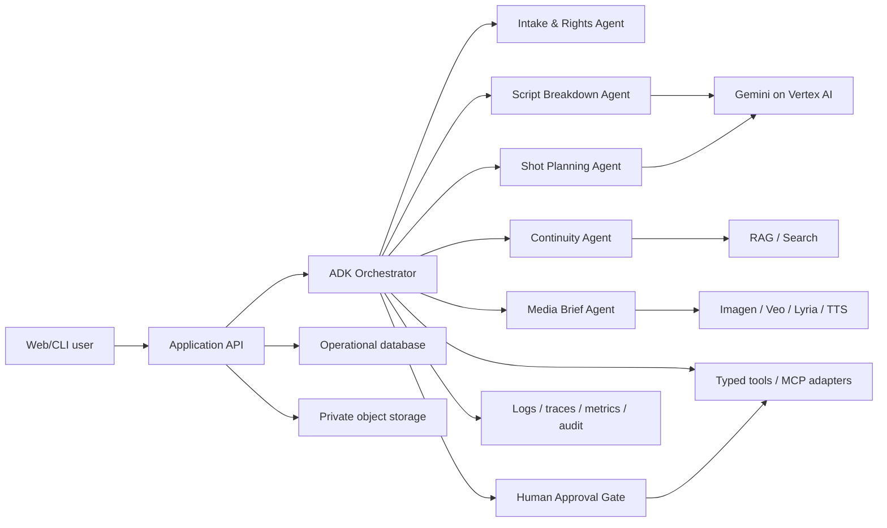

# 01 — Kiến trúc hệ thống

## Kiến trúc tham chiếu



## Trách nhiệm thành phần

### Application API

- Xác thực người dùng, tenant/project isolation và rate limit.
- Cấp signed upload/download URL có thời hạn ngắn.
- Tạo workflow run, nhận approval và phục vụ trạng thái.
- Không nhét business logic hoặc prompt vào controller.

### ADK Orchestrator

- Nắm state machine và điều kiện chuyển bước.
- Gọi agent chuyên môn; kiểm tra output schema trước khi lưu.
- Dừng ở approval gate, resume bằng event có chữ ký/audit.
- Áp timeout, budget, retry và circuit breaker ở biên tool.

Với ADK hiện hành, ưu tiên **graph/dynamic workflow** cho luồng mới. Sequential/parallel/loop workflow vẫn hữu ích cho đoạn luồng nhỏ, xác định được. Không dùng LLM để quyết định thứ tự cố định mà code đã biết.

### Agent chuyên môn

| Agent | Đầu vào | Đầu ra | Quyền tool |
|---|---|---|---|
| Intake & Rights | file + metadata/consent | manifest, quyền xử lý, quarantine flag | read metadata, scan |
| Script Breakdown | normalized text/pages | scenes, entities, requirements, citations | read-only corpus |
| Continuity | versioned scenes + knowledge | issue list, evidence, confidence | retrieval only |
| Shot Planning | approved breakdown + constraints | shot list draft | read-only; no publish |
| Media Brief | approved shot | prompt/preview request | generation only after approval |
| Export | approved artifacts | deterministic JSON/CSV/PDF package | write scoped artifact |

### Dữ liệu

- **Object store:** file gốc và artifact lớn; versioning, encryption và lifecycle.
- **Operational DB:** project, screenplay version, workflow state, approval, tool ledger.
- **RAG/Search:** chunk, embedding, retrieval metadata; không là source of truth cho nghiệp vụ.
- **Audit/analytics:** sự kiện bất biến hoặc append-only, được redaction trước khi xuất.

## Luồng một yêu cầu

1. API xác thực, tạo `project_id`/`run_id` và upload URL.
2. Intake xác minh MIME/kích thước/quyền, quét file, lưu immutable original.
3. Parser tạo normalized document với page/time offsets.
4. Breakdown agent trả structured output; validator từ chối field/schema sai.
5. Người dùng sửa/phê duyệt; hệ thống lưu cả proposal và accepted revision.
6. Continuity và shot planning có thể chạy song song trên bản đã phê duyệt.
7. Media generation hoặc external write chỉ chạy qua approval token một lần.
8. Export deterministic; log provenance bao gồm model/config/prompt version/source/tool result.

## Ranh giới tin cậy

- Trình duyệt ↔ API công cộng.
- API ↔ agent runtime dùng service identity.
- Agent ↔ model/tool/MCP là vùng dữ liệu không đáng tin mặc định.
- MCP server bên thứ ba ↔ hệ thống nội bộ phải qua allowlist, auth và schema validation.
- File người dùng và nội dung retrieval có thể chứa prompt injection; được coi là **data**, không phải instruction.

## Cấu trúc repository dự kiến ở M1

```text
agentic_cinema/
├── apps/
│   ├── api/                 # REST/WebSocket facade
│   └── web/                 # review and approval UI
├── agents/
│   ├── orchestrator/
│   ├── screenplay/
│   ├── continuity/
│   └── media_brief/
├── packages/
│   ├── domain/              # schemas and invariants
│   ├── prompts/             # versioned prompt assets
│   └── tools/               # adapters, MCP clients, policies
├── evals/                   # gold cases, trajectories, rubrics
├── infra/                   # Terraform and deployment config
├── tests/
└── docs/
```

## Quy tắc phụ thuộc

- `domain` không phụ thuộc SDK/model/vendor.
- Agent phụ thuộc `domain` và interface của tool, không phụ thuộc credential implementation.
- Adapter bên ngoài phụ thuộc interface, đặt riêng theo provider.
- UI không gọi model trực tiếp.
- Prompt là asset có version, review và eval; không chôn chuỗi dài rải rác trong code.

## Quyết định build-vs-buy

- Dùng ADK cho orchestration/session/tool integration.
- Dùng managed runtime/search khi giảm đáng kể vận hành; giữ domain schema và export portable.
- Chỉ thêm partner/MCP khi giải quyết use case cụ thể, không thêm để “đủ logo”.
- Tách service khi có khác biệt về trust boundary, scale hoặc lifecycle; MVP có thể là modular monolith.
