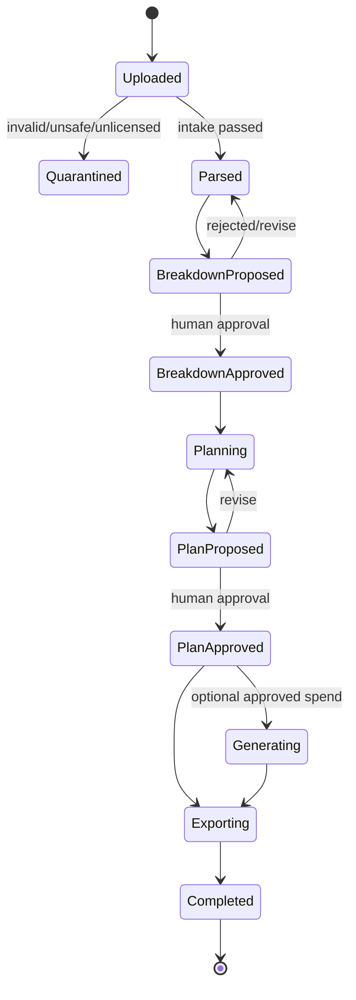

# 03 — Quy trình nghiệp vụ điện ảnh

## State machine cấp cao

Mỗi chuyển trạng thái phải có actor, timestamp, input version, output version và reason. Resume không chạy lại side effect đã thành công.

## 1. Intake và rights check

### Đầu vào bắt buộc

- tên dự án và owner;
- loại file, ngôn ngữ, phiên bản kịch bản;
- tuyên bố quyền sử dụng/consent;
- retention class và mức nhạy cảm;
- tùy chọn không dùng cho training/analytics ngoài phạm vi đã nêu.

### Kiểm tra

- MIME thực tế, extension, kích thước, virus/malware;
- hash SHA-256 để chống trùng và chứng minh phiên bản;
- file encryption, bucket path theo tenant/project;
- PDF text-native hay scan; scan chuyển OCR queue;
- từ chối URL nội bộ/localhost để ngăn SSRF nếu ingest từ URL được thêm sau này.

## 2. Parse và chuẩn hóa

Giữ ba lớp riêng:

1. `original`: byte bất biến.
2. `normalized_document`: text/page/block/time offset đã chuẩn hóa.
3. `domain_projection`: scene/entity/breakdown có schema.

Không sửa original. Nếu parser thay đổi, tạo projection version mới để so sánh và rollback.

## 3. Script breakdown

Pipeline đề xuất:

1. Tách scene heading và page spans bằng parser xác định được khi có thể.
2. Gemini xử lý trường mơ hồ và đa phương thức.
3. Structured output theo JSON Schema/Pydantic.
4. Validator áp invariants: scene order, source span tồn tại, entity ID hợp lệ.
5. Reconciler gộp alias nhân vật/bối cảnh nhưng giữ tên gốc.
6. Agent tạo proposal; không ghi đè bản người dùng đã duyệt.

Mọi claim như “cảnh đêm”, “cần mưa”, “nhân vật bị thương” phải có `evidence[]` trỏ về page/block hoặc timecode.

## 4. Continuity review

Phân loại issue:

- timeline và time-of-day;
- vị trí/di chuyển của nhân vật;
- prop/costume trạng thái giữa cảnh;
- tên/tuổi/quan hệ nhân vật;
- lời thoại hoặc chi tiết mâu thuẫn;
- khác biệt giữa screenplay version.

Một issue gồm `severity`, `confidence`, `claim`, `evidence`, `suggested_resolution` và `requires_human_judgment`. Confidence thấp không được hiển thị như sự thật.

## 5. Shot planning

Shot plan là đề xuất có constraints, không phải quyết định nghệ thuật cuối cùng:

- scene/beat tham chiếu;
- shot size, angle, movement, lens intent (không giả vờ biết thiết bị chưa cung cấp);
- subject/action/dialogue coverage;
- estimated complexity;
- sound/VFX/art/lighting notes;
- safety/consent flags;
- storyboard prompt độc lập với model.

Tránh bịa ngân sách, lịch, camera, location hoặc diễn viên. Nếu thiếu, field phải là `unknown` hoặc assumption rõ ràng.

## 6. Media brief và generation

MVP mặc định sinh **brief/prompt**, không sinh media hàng loạt. Khi người dùng bật preview:

1. Hiển thị model, số lượng, kích thước/thời lượng và ước tính chi phí.
2. Kiểm tra quyền/consent và policy.
3. Nhận approval token gắn với đúng request hash.
4. Gọi Imagen/Veo/Lyria/TTS qua queued job.
5. Lưu prompt, seed/config nếu có, model version, safety result và output hash.
6. Gắn nhãn “AI-generated preview”; không tự động coi là final asset.

## 7. Export

Export phải deterministic từ bản đã duyệt:

- JSON canonical dùng cho API/backup;
- CSV cho scene, cast, prop, location, shot;
- PDF review package (milestone sau);
- manifest gồm schema version, source hashes, approval IDs và provenance.

Tên file không lấy trực tiếp từ input chưa sanitize. Download dùng quyền tạm thời và ghi audit event.

## Failure handling

| Lỗi | Cách xử lý |
|---|---|
| Model timeout/429 | exponential backoff + jitter, giới hạn retry, resume |
| Structured output invalid | một lần repair có schema; sau đó human review |
| Tool trả dữ liệu mâu thuẫn | giữ cả evidence, không tự chọn nếu rủi ro cao |
| Partial media generation | lưu item thành công, retry item idempotent |
| Approval hết hạn | yêu cầu phê duyệt mới, không tái sử dụng token |
| Source version đổi giữa run | dừng, tạo run mới hoặc rebase có xác nhận |

## Checklist nghiệm thu workflow

- [ ] Có thể dừng/resume sau mỗi approval gate.
- [ ] Re-run không nhân đôi side effect.
- [ ] Mỗi output truy về input/model/prompt/tool version.
- [ ] Có đường sửa thủ công không cần prompt lại toàn bộ.
- [ ] Một bước thất bại không làm mất proposal/approval trước đó.
