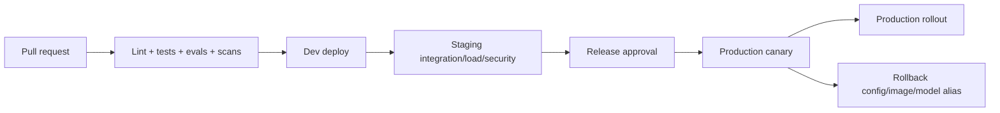

# 08 — Triển khai, vận hành và chi phí

## Lựa chọn runtime

### Vertex AI Agent Engine / Agent Runtime

Ưu tiên khi cần deployment/session/runtime tích hợp sâu với ADK và Vertex AI. Xem [overview](https://cloud.google.com/vertex-ai/generative-ai/docs/agent-engine/overview) và [deploy](https://cloud.google.com/vertex-ai/generative-ai/docs/agent-engine/deploy).

### Cloud Run

Phù hợp cho API, webhook, worker/tool server hoặc agent service đóng gói container. Xem [Cloud Run quickstarts](https://cloud.google.com/run/docs/quickstarts).

### GKE

Chỉ cân nhắc khi cần control/network/runtime hoặc workload phân tán mà managed runtime/Cloud Run không đáp ứng; không phải mặc định cho MVP.

Kiến trúc khả thi: Web/API trên Cloud Run, orchestrator trên Agent Engine, async media jobs qua queue/worker, artifact trong Cloud Storage, metadata trong database quản lý.

## Môi trường và promotion

- Infrastructure as Code cho API, IAM, bucket, secret binding, alert và budget.
- Artifact bất biến, image digest và provenance; không build lại giữa staging/prod.
- Database/schema migration có backward compatibility và rollback plan.
- Prompt/workflow/model config promotion cùng release manifest.

## CI/CD tối thiểu

1. Format/lint/type/unit.
2. Contract/workflow tests với provider mock/replay.
3. Regression + adversarial eval theo budget CI.
4. Secret, dependency, container/IaC scans.
5. Build/SBOM/sign artifact.
6. Deploy dev/staging bằng identity liên kết.
7. Smoke test và manual approval cho production.

## Reliability

### SLO ban đầu

- API availability và latency tách khỏi long-running workflow.
- Workflow success, time-to-first-draft và queue age.
- RPO/RTO cho metadata, source asset và audit.

Chốt con số sau baseline; media generation async không nên bị ràng buộc bởi timeout request đồng bộ.

### Resilience

- Queue cho công việc dài; lease/visibility timeout.
- Idempotency key cho create/export/generate.
- Exponential backoff + jitter; retry đúng mã lỗi.
- Circuit breaker cho provider lỗi và bulkhead theo tenant.
- Dead-letter queue + replay có kiểm soát.
- Graceful degradation: nếu media generation lỗi vẫn xuất shot plan/brief.

## FinOps

Nguồn chi phí chính:

- Gemini input/output và context/media processing;
- embedding/index/retrieval;
- Imagen/Veo/Lyria/TTS jobs;
- storage/egress/logging;
- database, queue, runtime và observability partner.

Kiểm soát:

- budget/alert ở project và dashboard theo tenant/run;
- max input size, context, output, steps, retries và generations;
- cache đúng quyền/retention; reuse parse/embedding theo content hash;
- model routing: model nhanh/rẻ cho parse/routing, model mạnh chỉ cho bước cần suy luận — sau khi eval chứng minh;
- preview thấp/nhỏ trước high-quality generation;
- log sampling/retention, tránh log content khổng lồ;
- hard quota/kill switch cho media generation.

Luôn xem [pricing](https://cloud.google.com/vertex-ai/generative-ai/pricing), [quotas](https://cloud.google.com/vertex-ai/generative-ai/docs/quotas) và [Cloud Billing budgets](https://cloud.google.com/billing/docs/how-to/budgets) hiện hành. Không đặt giá cố định trong code/tài liệu lâu dài.

## Backup, restore và deletion

- Version/backup metadata database; kiểm thử restore định kỳ.
- Object storage version/lifecycle phù hợp với quyền và chi phí.
- RAG index có thể rebuild từ nguồn + manifest; không coi index là bản sao duy nhất.
- Audit retention theo policy; tách khỏi content retention nếu cần.
- Deletion job có inventory/receipt và kiểm tra eventual cleanup.

## Runbook production

- [ ] Project/region/model alias đúng môi trường.
- [ ] Service account/IAM và secret binding đã review.
- [ ] Budget, quota, alerts, dashboards, on-call owner sẵn sàng.
- [ ] Eval/release manifest gắn với artifact deploy.
- [ ] Rollback/kill switch được thử.
- [ ] DPA/terms/retention của provider được review.
- [ ] Backup/restore/deletion drill hoàn tất.
- [ ] Public endpoint có auth, abuse/rate protection.
