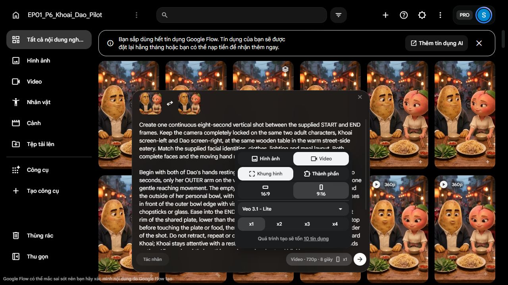

# 227 — Ghi nhận duyệt M và chuẩn bị thử chuyển động S → M

**Cập nhật REC228:** owner hủy phép thử tay riêng và chuyển sang sản xuất rồi kiểm đầu ra, trong số credit còn lại. Request ba take dưới đây đã hủy trước submission; giữ làm lịch sử, không còn là gói chờ chạy. Approval M và hai nguồn S/M vẫn được giữ.

Ngày: 2026-10-07. Giai đoạn **P7 khắc phục, hoàn thiện G1**. Owner đã chấp nhận tư thế ảnh tĩnh REF01-M v03. Đã tách đúng nguồn S/M thành hai asset Flow riêng, kiểm byte native và chuẩn bị gói thử. **Chưa gửi video, chưa chi credit, chưa có motion PASS.**

## Quyết định và nguồn đã khóa

[Approval](evidence/227/owner-reference-approval.json) ghi nguyên văn “duyệt nhé, tiếp tục đi”, áp dụng cho M v03 và việc tiếp tục chuẩn bị. Không mở rộng thành nghiệm thu toàn bộ S/E/REF03-S, full G1 hoặc full AV. S v01 là nguồn làm việc của tư thế M đã duyệt; E/REF03-S v02 vẫn là các ứng viên ảnh đã kiểm.

| Slot | Asset Flow riêng | Image UUID | SHA-256 native |
| --- | --- | --- | --- |
| START S v01 | `REF01-S_v01_INPUT_REC227` / `c618f06b-fc7a-474c-be1d-9ed62ce87347` | `46352b9d-1834-40fa-8133-076bfecc9a6d` | `eba9a13c86f359df458022a5a54664264e5bb29fcca08d6181454cb1ee482422` |
| END M v03 | `REF01-M_v03_ACCEPTED_REC227` / `d9e64ec1-dc0d-4c80-bcb6-b1e77ece951e` | `83124e9c-4f6a-4c11-b9ce-697c4e3fcd6c` | `66defd18afc0845da8b34968446b98f547dcad951e6712e2e6a81ff2d5e2017c` |

Đã tải lại hai asset tách và đối chiếu với native gốc: cả hai giữ nguyên byte, 768 × 1376 JPEG. Owner copy cũng đồng hash. [Readback](evidence/227/input-readback.json) và script `scripts/record_ep01_rec227_inputs.py` kiểm nguồn, bản tải, decode, prompt nguyên văn trong draft UI và phép tính dự toán. Hai slot đã kiểm bằng preview image UUID, không suy từ tên card.

## Gói thử cụ thể — đang chờ duyệt chạy

[Request](evidence/227/motion-request-DRAFT.json), [prompt đúng bản đã review](evidence/227/R01-SM-motion.prompt-DRAFT.txt), SHA-256 prompt `af94764252de0a2a057490eec874059d9804b1caa92e7bfa01d552c054cfafc5`.

- Google Flow, Veo 3.1 Lite, start/end frames, dọc 9:16, 720p, 8 giây, x1 mỗi request.
- Đề nghị **ba take cùng prompt và cặp nguồn**, mỗi lượt quote live 10 credit, tổng trần **30 credit**. Đây là ba ứng viên so độ ổn định, không phải ba cảnh nối nhau hoặc thí nghiệm thay biến.
- Số dư kiểm trực tiếp trong lần chuẩn bị này: **77**. Dự toán còn 47 nếu cả ba lượt đều bị trừ đúng quote; chưa phải delta thực tế hoặc cam kết billing.
- Không voice mới, không Quality, không M → E hoặc retry ngoài batch. Chưa bấm “Bắt đầu tạo”.

Đào dùng tay ngoài, phía phải hình/gần ly, với một lần quanh ngoài bát đến gần vành phải đĩa; mục tiêu vươn khoảng hai giây, giảm tốc và dừng trước tiếp xúc, giữ phần còn lại để quan sát drift. Hai mặt cùng thấy, môi khép; camera và bữa ăn giữ nguyên. Gap cần tồn tại xuyên pha dừng, không chỉ ở frame cuối.

**Giới hạn:** đây chỉ là kiểm đường tay–dừng–giữ, chưa kiểm Đào nói N01 hoặc nghe Khoai nói “Khoan”. Không ghép lời lên hai miệng khép rồi nhận R01 đạt khẩu hình/diễn xuất. Tám giây là thời lượng sinh, không mặc định dùng cả tám giây vào phim 30 giây. M → E và nối N02 B còn mở.

UI cấu hình Lite không cho thấy công tắc audio-off trong phần đã kiểm. Prompt cấm thoại và nhép môi; **không gọi audio đã tắt**. Nếu output có tiếng thì phải kiểm track thực; tiếng native không được dùng thay giọng đã khóa K20/D06.

## Hai phản biện độc lập và kết luận root

[EDIT/ACT](evidence/227/01_motion-preflight-edit.md): READY_TO_REQUEST_APPROVAL, không MAJOR trong phạm vi test hình học; timing dựng, cue nghỉ đầu, khoảng cách 3D và audio còn MINOR/UNKNOWN.

[CONT/FOOD](evidence/227/02_motion-preflight-cont.md): READY_TO_REQUEST_APPROVAL; rủi ro chính là đường tay qua bát và đầu đũa. Đã kiểm bốn bản native/download khớp hash. Reviewer chỉ kiểm local, không tự xác nhận route/quote live.

Root đã đọc đầy đủ cả hai sau khi từng reviewer chốt độc lập. **Đủ để trình đúng batch, chưa đủ để submit khi thiếu approval hoặc nhận motion đạt.** Tay che một phần bát là che khuất hình chiếu; không tự kết luận xuyên bát, cũng không tự kết luận đã clear 3D.

## Trình tự sau khi owner duyệt batch

1. Kiểm lại slot/content UUID, prompt/hash, model/route/quote và số dư ngay trước gửi. Dừng nếu quote vượt 10/lượt hoặc trần 30, nguồn sai hoặc quyền không đúng phạm vi.
2. Chạy tuần tự ba x1; sau mỗi lượt nhận đúng native, hash/decode và ghi số dư. Nếu tải chưa được, xử lý tải trước khi sinh tiếp; không tự tạo lại để thay download.
3. Xem liên tục toàn shot, trích toàn frame native theo FPS thực. Kiểm tay đúng phía, quỹ đạo qua bát/đũa/ly, lần tới gap, dừng và toàn pha giữ; ghi frame/timecode đầu–cuối lỗi. Kiểm cả mặt, môi, camera, đồ phục vụ và món lạnh không khói.
4. EDIT/ACT và CONT/FOOD review riêng từng take. FAIL nếu có collision, food/plate contact, overshoot, retract/loop, nguồn hoặc mặt sai. REVIEW_NEEDED nếu vùng khuất không đủ kết luận; không lấy frame đẹp cuối để xóa lỗi trước.
5. Trình owner bảng so ba take và clip đúng nguồn. Motion pass chỉ đóng bài thử S → M, không đóng lời–hình, M → E hoặc toàn phim. Sau đó mới chọn cách xử lý cảnh thoại và nối N02.

## Kinh nghiệm công cụ đã kiểm

- “Lưu vào dự án” trong menu lịch sử tạo asset riêng từ phiên bản đang chọn mà không cần sinh hoặc upload lại. Card có thể xuất hiện chậm; chờ/đọc UI trước khi thử lại.
- Asset/image UUID có thể đổi khi tách nhưng native byte vẫn giống; xác nhận bằng hash bản tải, không chỉ label.
- Đổi tên bằng textbox `fill` rồi Enter mới commit; `setValue` đơn thuần chưa đủ trong lần này. Download M trước đổi tên vẫn mang nhãn S cũ, nên mapping/hash là bắt buộc.
- Không sửa hoặc xóa nguồn gốc/lịch sử lỗi. Giữ watermark native. Áp dụng [computer-use](C:/Users/PC/.codex/plugins/cache/openai-bundled/computer-use/26.930.61225/skills/computer-use/SKILL.md) để kiểm UI và lưu bằng chứng; kỷ luật prompt giữ/sửa của [imagegen](C:/Users/PC/.codex/skills/.system/imagegen/SKILL.md) dùng cho nguồn ảnh Flow đã chọn, không chuyển sang công cụ tạo ảnh khác.

## Tổng hợp vòng

Đã xác định: M được duyệt về ảnh tĩnh; S/M asset riêng đồng byte nguồn; draft đúng hai slot, quote 10 và số dư 77; hai preflight độc lập hoàn tất.

Quyết định đã chốt: giữ M v03, tiếp tục chuẩn bị, giữ nguyên kịch bản/giọng/bữa ăn. Giả định: test 8 giây để cô lập hình học, không phải cảnh thoại hoàn chỉnh hoặc timing dựng cuối.

Còn mở: duyệt exact batch 30 credit; chuyển động 3D thực, nhịp dừng/hold, audio thực; lời–hình R01, M → E, các khoảng thiếu R04–R09 theo bản đồ223 và dựng thử toàn tập. **G1 vẫn mở, chưa master/Quality/bàn giao.**

Bước tiếp: owner duyệt hoặc đổi phạm vi **ba lượt Lite S → M, trần 30 credit**. Hồ sơ/bản copy ở [folder owner](C:/Users/PC/Downloads/du_an_nem_bui/227_motion_preflight).
