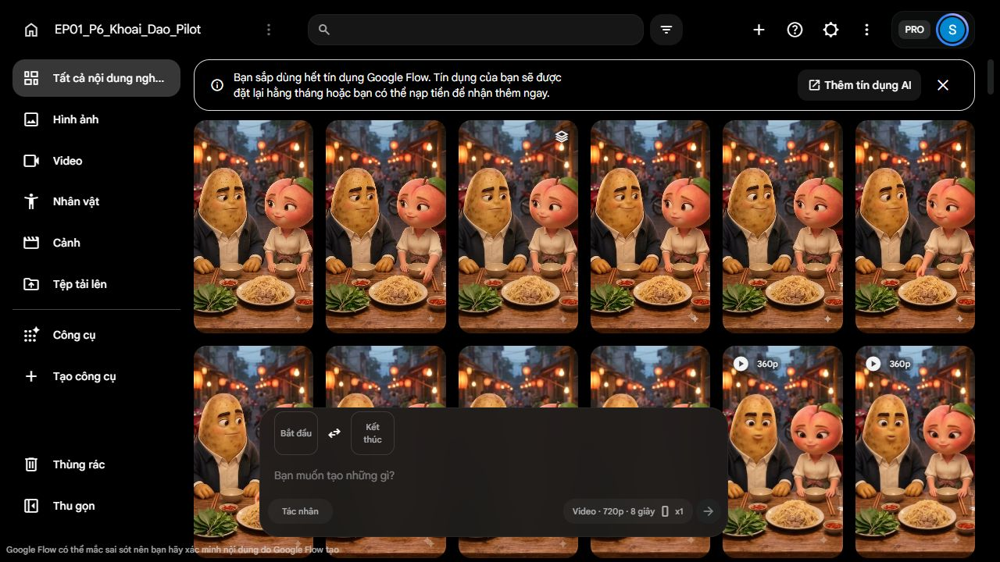

# 228 — Bỏ thử riêng, sản xuất rồi kiểm đầu ra

Ngày: 2026-10-07. **P7 recovery / PRODUCTION_ONLY_DIRECTION_LOCKED / FIRST_REQUEST_NOT_READY / NOT_RELEASE.**

Owner: “Không cần thử tay riêng nữa, làm sản xuất rồi check thôi, chứ k còn ngân sách để thử nữa”. [Quyết định](evidence/228/owner-production-direction.json) thay đề nghị227: bỏ test S→M ba take/trần30, không có khoản credit bổ sung. Giữ kịch bản, giọng, hình B, món và cổng chất lượng.

## Thực hiện ngay

- Đã xóa draft prompt và slots của phép thử bị hủy trên Flow; nút tạo bị vô hiệu hóa. Đây là bỏ draft chưa submit, không xóa media nguồn hoặc bằng chứng lịch sử; draft cũ có thể dựng lại từ hồ sơ227 nhưng không còn quyền chạy.
- Đã kiểm UI số dư **77 credit**; chi trong228 **0**, generation **0**. Không test tay, không batchx3, không thu giọng mới/Quality.
- Request227 và resolution đã ghi CANCELLED/SUPERSEDED. Approval pose M v03 và hai asset S/M giữ nguyên.
- [Root readback](evidence/228/root-readback.json) kiểm nguồn N02 B, N01 audio, S/M đúng hash và draft cũ không còn; không nhận media đã đạt từ kiểm file.

Vận hành UI/lưu bằng chứng theo [computer-use](C:/Users/PC/.codex/plugins/cache/openai-bundled/computer-use/26.930.61225/skills/computer-use/SKILL.md). Không đổi nền tảng hoặc cài công cụ mới.

## Chính sách làm việc từ đây

**Mỗi lượt sinh phải nhằm tạo một đơn vị footage dùng trong phim.** Mặc định đề xuất x1 rồi QC chính output: không có ba take thử riêng trước production, không gọi footage chưa đạt là final. Chuẩn bị ảnh/brief, đối soát nguồn, dựng thử local và review không trả phí vẫn làm để tránh gửi request thiếu dữ liệu; không dùng chữ “test” để mở lại lượt sinh bị owner hủy.

Sau mỗi output: nhận đúng native → hash/decode/trích frame → kiểm mặt/lời–người nói/voice/miệng, diễn/hành động/F0–F4 → chọn range và kiểm nối. Reviewer độc lập theo217; root không tự duyệt thay reviewer. Phần chưa nghe/xem AV thật vẫn UNKNOWN và trình human checkpoint rõ phạm vi. Không có lỗi chặn mới đi sang finishing; technical PASS không thay kể chuyện PASS.

Nếu lỗi sửa local được mà không thay nghĩa/lời/giọng/mất mặt thì xử lý trong scope và ghi nguồn. Nếu phải sinh lại hoặc đổi coverage quan trọng: nêu lỗi, phần phim bị ảnh hưởng, quote và phần ngân sách còn lại, không tự retry. Request mới vẫn phải có phạm vi/route/giá thực; chỉ đạo production không là nạp thêm credit hoặc duyệt mọi phương án chưa biết.

## Phân bổ công việc toàn phim — chưa phải bảy request đã được duyệt

| Đơn vị | Mục tiêu giữ trong phim | Đầu vào / xử lý cần thiết |
| --- | --- | --- |
| P01: R01 | Đào nói và định lấy đĩa; Khoai nói “Khoan”; cô nghe, dừng/thu tay | N01 nguồn203 + phần mở N02 B, S/M/E; phải giải quyết coverage đầu B trước gửi |
| Giữ R02 | Khoai kể ký ức thấy mặt | N02 B exact đã duyệt222; không sinh lại cả lượt hoặc ghi âm lại |
| P03: R03 | Hỏi “Anh chờ ăn à?” / đáp “Chờ mẹ quay lưng” | Tiếng N03/N04 nguồn203, hình phải match B và đúng mouth attribution; dự kiến sửa video, không silent overlay |
| P04: R04 | Đào chuyển chú ý tới cốc, Khoai gắp A hướng mình | Thiếu khung đầu/cuối đúng B/F0→F1; lời không thêm, không contact miệng |
| P05: R05 | Đào thấy A rồi trêu; Khoai biết bị thấy và khựng | Cần F1→F2, mặt Đào nói N05, A còn kẹp; không chỉ cận phản ứng rời |
| P06: R06 | Khoai chữa cháy và đổi hướng A | F2→F3, mặt Khoai N06; nguồn154 chỉ có tiếng/diễn tham khảo, không đủ đường A |
| P07: R07–R08 | Đào hiểu, nói N07, đưa bát và nhận A | Chỉ gộp nếu cảnh chung làm rõ cả lời và thả một lần;207 là ứng viên insert chưa tự PASS/match B |
| P09: R09 | A ở bát Đào; Khoai gắp miếng B cho mình, cả hai hiểu | Nguồn209 chưa đủ đường B; cần đích mới, không reset bát trống |

Bảy đơn vị mới là **forecast nhiệm vụ**, không mặc định mỗi đơn vị bằng một request hoặc đều dùng Veo Lite. R07–R08 không tự gộp nhiều hành động nếu input/media không đáp ứng. Không dùng lại cảnh sai chỉ vì đã tốn credit; không bỏ mặt người nói, câu hoặc kết đã chốt để tiết kiệm.

### Kiểm soát 77 credit

Phép tính70+7 ở vòng trước chỉ dựa giả định bảy request giá10 và đạt ngay. Quote10 tại227 áp dụng Lite/720p/8s/x1, **không áp mặc định cho tuyến thoại Omni sửa video**. Đây không phải dự toán hoàn tất đã được chứng minh.

Số dư77 là giới hạn làm việc, chưa bảo đảm đủ. Không chi30 cho test riêng. Lập quote theo từng request sản xuất và cộng phần còn thiếu trước gửi; cập nhật balance/cost thực sau mỗi lượt. Giữ phần còn lại cho đơn vị chưa làm thay vì tự dùng để sửa cảnh đầu. Không chuyển Quality; không cam kết luôn còn7 hoặc chỉ cần7clip.

Không xin credit mới ở vòng này. Nếu quote/phần thiếu vượt77 hoặc output lỗi cần trả phí thì dừng trình đúng thiếu hụt, không hạ chuẩn ngầm hoặc dùng hết account cho thử.

## Điểm cần chốt trước P01

Root đã xem M v03 và B native frame0: **M còn tay vươn, B đã tay nghỉ**. Ghép thẳng gây nhảy tay; cho tay thu xong trước khi “Khoan” phát ra làm sai nguyên nhân. Prompt test227 cố ý không thoại và giữ M nên không thể đổi nhãn thành P01 production.

Đề xuất nghệ thuật: **cho phép thay coverage hình ở phần “Khoan” đầu N02 B**, để khung chung thấy mặt Khoai nói và Đào thực sự dừng rồi thu tay. Giữ nguyên tiếng B, toàn lời và phần ký ức phía sau; không sửa/xóa native B gốc. Timing/range phải đo và kiểm lại ở bản dựng mới, không bịa mốc từ hoặc cắt giữa âm. Không chỉ phủ hình tay/món lên câu của Khoai.

Nếu giữ nguyên toàn hình B từ frame0, causal stop và reset S/M/E chưa có cách được chứng minh; không chi để hi vọng sẽ nối được. Thay coverage này cần quyết định owner vì scope222 chấp nhận whole native B, chưa duyệt bản edit đầu B. Đây là quyết định nối cảnh, không đề nghị thử riêng hoặc thu giọng.

[Brief P01 DRAFT](evidence/228/R01-production-brief-DRAFT.md) đã ghi lời/nguồn/đầu–cuối/QC và blocker. Chưa input composite, chưa quote/sinh. [DIR/EDIT/DLG maker](evidence/228/01_production-route-maker.md) và [CONT/DOP critic độc lập](evidence/228/02_production-continuity-review.md) cùng chỉ ra mismatch M→B và không coi forecast70 là đủ. Root đã đọc đầy đủ hai báo cáo sau khi từng vai chốt độc lập. Maker rehash/probe N01/B, kiểm thêm A03/E; critic xem S/M/E/Bf0. Không có actual hearing hoặc fullAV mới ở các run này.

## Tổng hợp vòng

Đã xác định: test227 hủy trước submit; Flow draft đã bỏ, account77; nguồn thoại/ảnh không đổi. Quyết định đã chốt: chỉ sản xuất rồi kiểm output, không test riêng/x3, không thêm credit hoặc nới chất lượng.

Giả định: x1 là mặc định đề nghị sản xuất; footage đạt có thể tái dùng; bảy nhiệm vụ mới không đồng nghĩa bảy request đủ ngân sách. Còn mở: coverage “Khoan”, timing thực P01, input/quote từng đơn vị, R04–R09 đúng B và bản dựng30s. G1 vẫn mở, chưa production-ready toàn phim/master.

Bước tiếp: owner chốt phạm vi coverage “Khoan” → chuẩn bị đúng input thoại/hình và quote P01 → tạo output sản xuất, QC source/range/join ngay. Không quay lại thử tay riêng.
